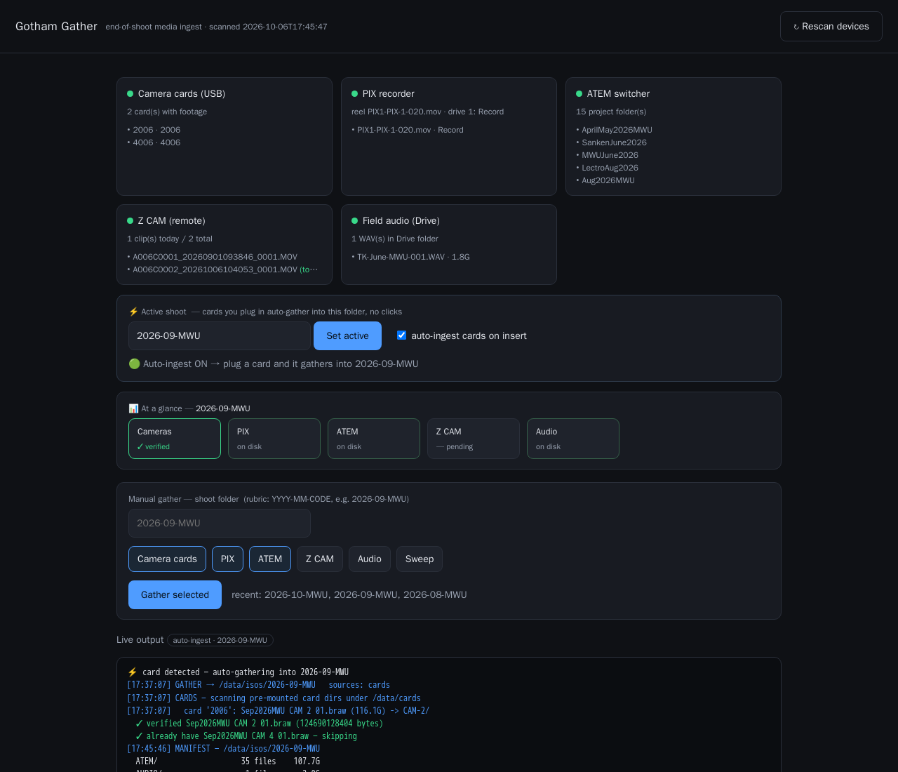

# Gotham Gather — EZ Instructions (tech cheat-sheet)

Quick reference for running and maintaining the app. Full deploy details are in
`UNRAID-SETUP.md`; architecture in `README.md`.

- **App (team UI):** http://192.168.100.50:8787
- **Repo:** https://github.com/Gotham-Sound/gotham-gather (private)
- **Code on server:** `/mnt/disks/VM_DISK/unclaude/gather-app`
- **Container:** `gotham-gather` (Unraid Docker tab) · image `gotham-gather:latest`
- **Media lands in:** `/mnt/user/isos/<shoot>/` (e.g. `2026-09-MWU`)



*The dashboard: device status cards up top, the ⚡ Active-shoot auto-ingest banner, the
📊 At-a-glance strip (pending → copying → ✓ verified per source), and the live gather log.*

---

## Everyday use (team)
1. Open the app. Set the **⚡ Active shoot** (rubric `YYYY-MM-CODE`, e.g. `2026-09-MWU`).
2. Plug camera cards into a **REAR** USB port → they auto-ingest into `CAM-N/`,
   with a live progress bar. The **📊 At a glance** strip shows each source:
   pending → copying % → ✓ verified.
3. PIX / ATEM / Z CAM: tick the source + **Gather** (or they're part of a full run).
4. Field audio: see below.

---

## Updating the app (after a code change)
```
cd /mnt/disks/VM_DISK/unclaude/gather-app
# edit code, then:
docker build -t gotham-gather:latest .
```
Then **Docker tab → `gotham-gather` → Edit → Apply** (recreates from the new local image).
A "couldn't pull image" warning is normal for a local build — it uses the local copy.

> Don't recreate **mid-copy** — it interrupts the running gather (it resumes, but
> re-verifies what was already done). Wait for the current copy, or deploy when a
> source just finished (finished files are skipped on the next run).

Commit + push changes:
```
git add -A && git commit -m "…"
git push    # origin = https://github.com/Gotham-Sound/gotham-gather.git
```

---

## Field audio — two ways
- **Normal:** TK uploads WAVs to the shared Drive folder
  (`1t8Bm5MCO_I64Z3ebDugy_rciigizeB81`). Run the **Audio** source — it grabs only the
  recent ones (last 72h), not old shoots'.
- **One-off link:** if TK shares a *direct link* instead, pull it by file ID:
  ```
  rclone backend copyid gdrive: <FILE_ID> "/mnt/user/isos/<shoot>/AUDIO/"
  ```
  (`<FILE_ID>` is the long string in the Drive URL `/file/d/<FILE_ID>/view`.)

---

## Plug-and-go cards (one-time setup)
For zero-click ingest the card must auto-mount on the host and reach the container:
1. **Unassigned Devices** (Main tab) → toggle **Automount ON** for the card.
2. Container must bind `/mnt/disks` with **`rslave`** propagation (in Extra Parameters):
   `--mount type=bind,source=/mnt/disks,target=/data/cards,readonly,bind-propagation=rslave`
   (see `UNRAID-SETUP.md`).
If a card doesn't appear: it's not mounted — hit **Mount** on it in Unassigned Devices,
or mount it by hand: `mount -t exfat -o ro /dev/sdX2 /mnt/disks/<label>`.

---

## Troubleshooting (things we actually hit)
| Symptom | Cause / fix |
|---|---|
| **Progress bar frozen at 0% / "starting…"** | Running the old image. Rebuild + Edit→Apply. (Fixed: output is read by `\r` so rsync % flows live.) |
| **"no cards" but a card is plugged in** | Card isn't *mounted*. Enable UD Automount, or Mount it in Unassigned Devices. Cards show as exfat USB disks (`lsblk`). |
| **Card copy hangs after one card** | A stale/failing `/mnt/disks` mount (dead USB device) stalled the scan. Hardened now (timeout-guarded). Clear dead mounts: `umount -l /mnt/disks/<name>`. |
| **Audio: "rclone auth/remote error"** | Usually a cold-start blip right after Apply — hit **Rescan**. If persistent: the rclone config mount must be **Read/Write** (token refresh). Re-auth: `rclone authorize "drive" --drive-scope=drive.readonly`. |
| **Nothing copies when a card is plugged in** | No **Active shoot** set, or auto-ingest unchecked. Set it at the top of the page. |
| **Front USB port** | Flaky — cards read as 0-byte / don't enumerate. Use a **REAR** port. |

---

## Verifying a shoot is fully backed up
`/mnt/user/isos/<shoot>/` should have (per what was shot): `CAM-1..N/` (braw masters),
`CAM-TK/` (Z CAM), `PIX/`, `ATEM/<Project>/`, `AUDIO/`. The app's **At a glance** strip
and the engine's `✓ verified` (byte/hash checks) confirm each. Every transfer is
size/hash-verified; nothing is deleted from a card, recorder, or Drive.

*Last updated 2026-10-06.*
